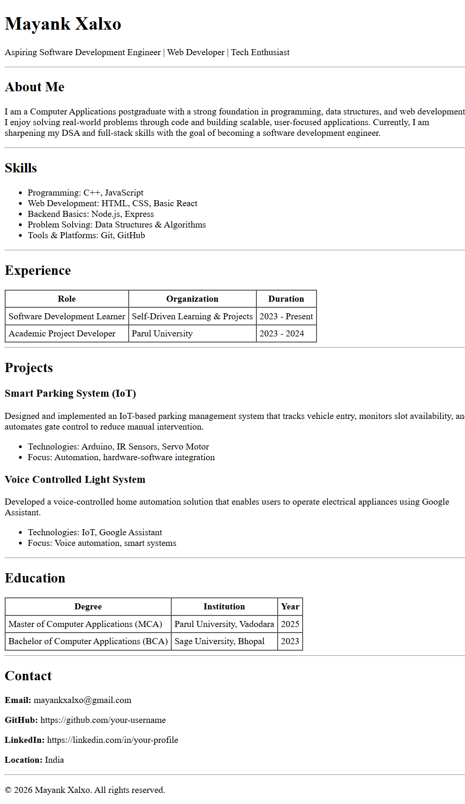

# HTML Resume Page Assignment

A clean, single-page resume website built using **pure HTML** as part of the **Web Dev Cohort 2026** assignment.

This project focuses on correct HTML structure, semantic elements, readability, and layout — without using any CSS.

---

## 🌐 Live Demo
🔗 https://mayank06r.github.io/html-resume-assignment/

---

## ✨ Key Highlights
- Built using **only HTML5** (no CSS, no frameworks)
- Proper use of semantic tags (`header`, `section`, `table`, `footer`)
- Clear and readable layout
- Structured sections for skills, experience, projects, and education
- Easy to navigate and evaluator-friendly

---

## 🛠️ Technologies Used
- HTML5

---

## 📂 Project Structure
html-resume-assignment/
│── index.html
│── README.md
│── screenshots/
│ └── resume-page-full.png

yaml
Copy code

---

## ▶️ How to Run Locally
1. Clone the repository
2. Open `index.html` in any modern web browser

No setup required.

---

## Screenshot

---

## 👤 Author
**Mayank Xalxo**  
Aspiring Software Development Engineer | Web Developer
